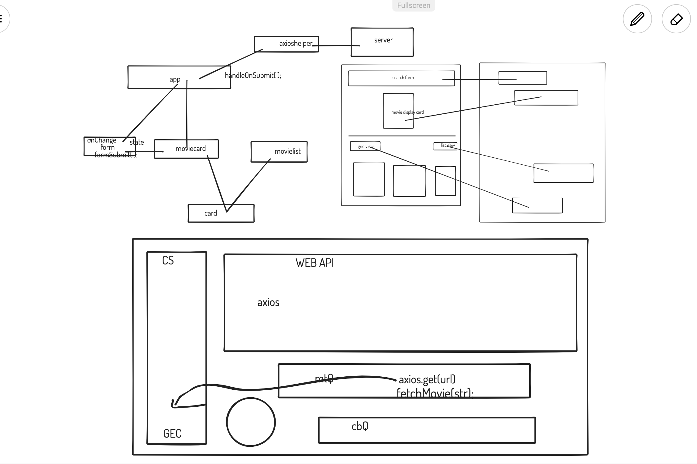

# Movie App

Live: https://movie-app-bishalk21.vercel.app/

This is a simple movie app that uses the [OMDb API](http://www.omdbapi.com/) to search for movies and display their details.

From this project, I have learned the following:

- axios
- react-router-dom
- react-bootstrap
- props, and props drilling and props updating
- state and state lifting
- react hooks - useState, useEffect
- react components

## How to use this app

- Clone this repo
- Run `npm install` to install all the dependencies
- Run `npm start` to start the app
- Open [http://localhost:3000](http://localhost:3000) to view it in the browser.

NOTE: ** Whenever using async/await, check where we are recieving the final data. **

Right place to find state

While learning:

